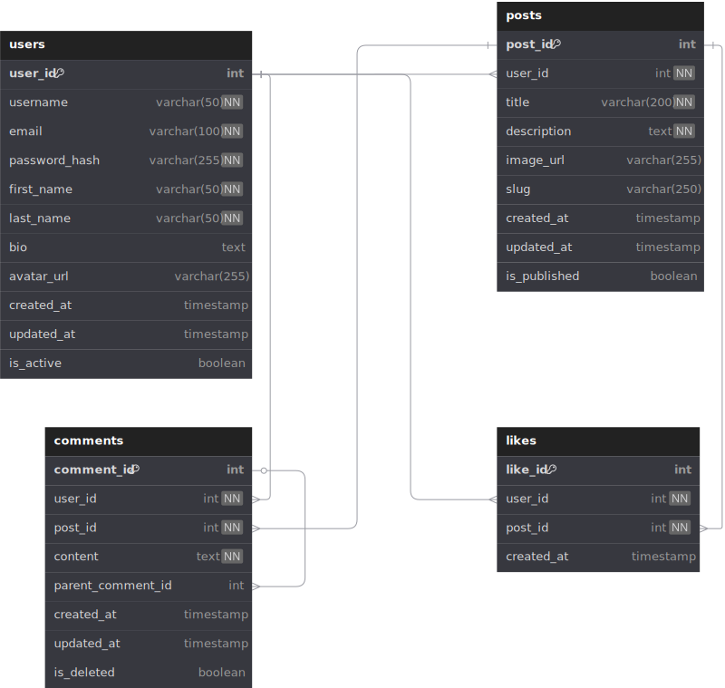
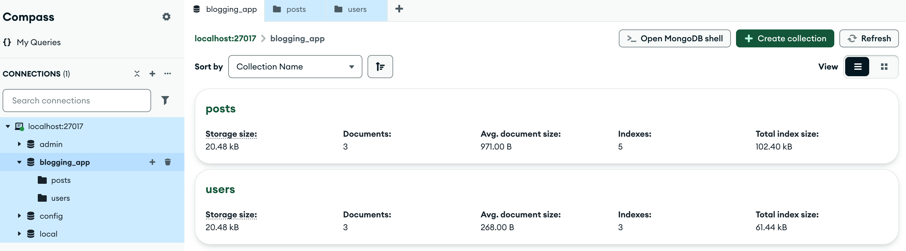
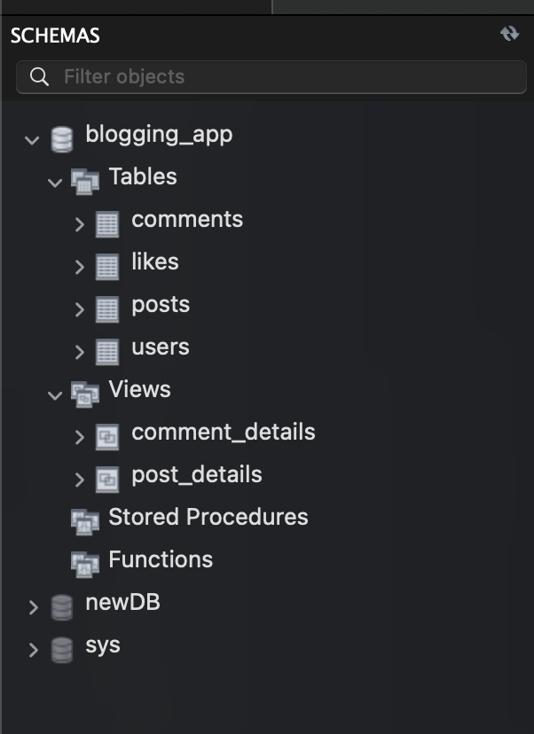
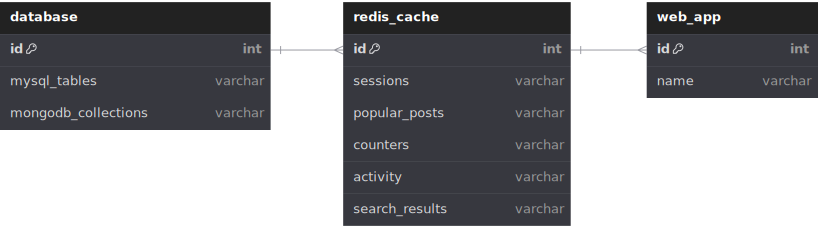

# Module 8 Lab: Blogging Application Database Design

This lab demonstrates comprehensive database design and implementation across multiple database technologies for a blogging application.

## Project Overview

A complete blogging platform that supports:
- **User management** (registration, authentication)
- **Post creation** (title, content, images)
- **User engagement** (likes, comments with replies)
- **Performance optimization** (caching, real-time features)

## Quick Start Guide

### 1. MySQL Setup
```bash
mysql -u root
source mysql_blog.sql
SELECT * FROM post_details;
```

### 2. MongoDB Setup
```bash
npm install mongodb
node mongodb_blog.js
```

### 3. Redis Setup
```bash
redis-server
redis-cli
```

This comprehensive lab demonstrates modern database architecture patterns used in production applications, from initial design through implementation and optimization.

## Technology Comparison

| Aspect | MongoDB | MySQL | Redis |
|--------|---------|-------|-------|
| **Type** | Document Database | Relational Database | In-Memory Cache |
| **Structure** | 2 Collections | 4 Tables | Key-Value Store |
| **Relationships** | Embedded Documents | Foreign Keys | Data Structures |
| **Queries** | Single Document Read | Multiple JOINs | Direct Key Access |
| **Consistency** | Eventual | ACID | In-Memory |
| **Scaling** | Horizontal | Vertical | Horizontal |
| **Use Case** | Read-heavy, Flexible | Complex relationships | Caching, Real-time |
| **Performance** | Fast Reads | Complex Queries | Ultra-fast Access |

## Files in This Lab

- `README.md` - This comprehensive guide
- `mongodb_blog.js` - Node.js MongoDB implementation for Exercise 2
- `mysql_blog.sql` - MySQL implementation for Exercise 3

## Key Learning Outcomes

1. **Database Design Principles** - Logical and physical modeling
2. **Technology Selection** - Understanding when to use SQL vs NoSQL vs Cache
3. **Performance Optimization** - Caching strategies and real-time features
4. **Scalability Patterns** - Horizontal vs vertical scaling approaches
5. **Real-world Implementation** - Production-ready code examples

## Exercise 1: Database Design

### Entity Relationship Diagram (dbdiagram.io format)
```dbml
Table users {
  user_id int [pk, increment]
  username varchar(50) [unique, not null]
  email varchar(100) [unique, not null]
  password_hash varchar(255) [not null]
  first_name varchar(50) [not null]
  last_name varchar(50) [not null]
  bio text
  avatar_url varchar(255)
  created_at timestamp [default: `CURRENT_TIMESTAMP`]
  updated_at timestamp [default: `CURRENT_TIMESTAMP`]
  is_active boolean [default: true]
}

Table posts {
  post_id int [pk, increment]
  user_id int [not null, ref: > users.user_id]
  title varchar(200) [not null]
  description text [not null]
  image_url varchar(255)
  slug varchar(250) [unique]
  created_at timestamp [default: `CURRENT_TIMESTAMP`]
  updated_at timestamp [default: `CURRENT_TIMESTAMP`]
  is_published boolean [default: true]
}

Table likes {
  like_id int [pk, increment]
  user_id int [not null, ref: > users.user_id]
  post_id int [not null, ref: > posts.post_id]
  created_at timestamp [default: `CURRENT_TIMESTAMP`]

  indexes {
    (user_id, post_id) [unique]
  }
}

Table comments {
  comment_id int [pk, increment]
  user_id int [not null, ref: > users.user_id]
  post_id int [not null, ref: > posts.post_id]
  content text [not null]
  parent_comment_id int [ref: > comments.comment_id]
  created_at timestamp [default: `CURRENT_TIMESTAMP`]
  updated_at timestamp [default: `CURRENT_TIMESTAMP`]
  is_deleted boolean [default: false]
}
```



### Key Relationships
- **Users → Posts** (1:Many) - One user can create multiple posts
- **Users → Likes** (1:Many) - One user can like multiple posts
- **Posts → Likes** (1:Many) - One post can have multiple likes
- **Users → Comments** (1:Many) - One user can write multiple comments
- **Posts → Comments** (1:Many) - One post can have multiple comments
- **Comments → Comments** (Self-referencing) - Comments can have replies

### Design Decisions
1. **Separate Likes Table** - Maintains audit trail instead of simple counter
2. **Nested Comments** - Self-referencing foreign key for comment replies
3. **Soft Delete Comments** - Preserves conversation context
4. **Slugs for SEO** - URL-friendly identifiers for posts
5. **Composite Unique Constraint** - Prevents duplicate likes

## Exercise 2: MongoDB Implementation

### Document-Based Design Philosophy
MongoDB uses **2 collections** with embedded documents for optimal read performance:

#### Users Collection
```javascript
{
  _id: ObjectId,
  username: "johndoe",
  email: "john@example.com",
  passwordHash: "$2y$10$hash...",
  profile: {
    firstName: "John",
    lastName: "Doe",
    bio: "Tech blogger",
    avatarUrl: "https://example.com/avatar.jpg"
  },
  createdAt: Date,
  updatedAt: Date,
  isActive: true
}
```

#### Posts Collection (with embedded likes & comments)
```javascript
{
  _id: ObjectId,
  title: "My Blog Post",
  description: "Post content goes here...",
  imageUrl: "https://example.com/image.jpg",
  slug: "my-blog-post",

  // Embedded author info (denormalized for performance)
  author: {
    userId: ObjectId,
    username: "johndoe",
    displayName: "John Doe"
  },

  // Embedded likes array
  likes: [
    {
      userId: ObjectId,
      username: "janedoe",
      likedAt: Date
    }
  ],

  // Embedded comments with nested replies
  comments: [
    {
      commentId: ObjectId,
      userId: ObjectId,
      username: "mikejohnson",
      content: "Great post!",
      createdAt: Date,
      isDeleted: false,
      replies: [
        {
          commentId: ObjectId,
          userId: ObjectId,
          username: "johndoe",
          content: "Thanks!",
          createdAt: Date,
          isDeleted: false
        }
      ]
    }
  ],

  // Cached statistics for performance
  stats: {
    likeCount: 5,
    commentCount: 8,
    viewCount: 150
  },

  createdAt: Date,
  updatedAt: Date,
  isPublished: true
}
```

### MongoDB Indexes
```javascript
// Users collection indexes
db.users.createIndex({ username: 1 }, { unique: true });
db.users.createIndex({ email: 1 }, { unique: true });

// Posts collection indexes
db.posts.createIndex({ "author.userId": 1 });
db.posts.createIndex({ createdAt: -1 });
db.posts.createIndex({ slug: 1 }, { unique: true });
db.posts.createIndex({ isPublished: 1 });
db.posts.createIndex({ "likes.userId": 1 });
```

### MongoDB Benefits vs Trade-offs
✅ **Benefits:**
- Single query to get complete post with all data
- No JOINs required
- Natural JSON structure for APIs
- Atomic updates for likes/comments
- Horizontal scaling ready

⚠️ **Trade-offs:**
- Data duplication (author info repeated)
- Document size can grow large with many comments
- Complex updates when user info changes
- Harder to query comments independently

### Usage
Run the Node.js MongoDB script:
```bash
npm install mongodb
node mongodb_blog.js
```



## Exercise 3: MySQL Implementation

### Relational Database Schema
```sql
-- Users table
CREATE TABLE users (
    user_id INT PRIMARY KEY AUTO_INCREMENT,
    username VARCHAR(50) UNIQUE NOT NULL,
    email VARCHAR(100) UNIQUE NOT NULL,
    password_hash VARCHAR(255) NOT NULL,
    first_name VARCHAR(50) NOT NULL,
    last_name VARCHAR(50) NOT NULL,
    bio TEXT,
    created_at TIMESTAMP DEFAULT CURRENT_TIMESTAMP,

    INDEX idx_username (username),
    INDEX idx_email (email)
);

-- Posts table
CREATE TABLE posts (
    post_id INT PRIMARY KEY AUTO_INCREMENT,
    user_id INT NOT NULL,
    title VARCHAR(200) NOT NULL,
    description TEXT NOT NULL,
    image_url VARCHAR(255),
    slug VARCHAR(250) UNIQUE,
    created_at TIMESTAMP DEFAULT CURRENT_TIMESTAMP,
    is_published BOOLEAN DEFAULT TRUE,

    FOREIGN KEY (user_id) REFERENCES users(user_id) ON DELETE CASCADE,
    INDEX idx_user_id (user_id),
    INDEX idx_created_at (created_at)
);

-- Likes table
CREATE TABLE likes (
    like_id INT PRIMARY KEY AUTO_INCREMENT,
    user_id INT NOT NULL,
    post_id INT NOT NULL,
    created_at TIMESTAMP DEFAULT CURRENT_TIMESTAMP,

    FOREIGN KEY (user_id) REFERENCES users(user_id) ON DELETE CASCADE,
    FOREIGN KEY (post_id) REFERENCES posts(post_id) ON DELETE CASCADE,
    UNIQUE KEY unique_user_post_like (user_id, post_id)
);

-- Comments table
CREATE TABLE comments (
    comment_id INT PRIMARY KEY AUTO_INCREMENT,
    user_id INT NOT NULL,
    post_id INT NOT NULL,
    content TEXT NOT NULL,
    parent_comment_id INT NULL,
    created_at TIMESTAMP DEFAULT CURRENT_TIMESTAMP,
    is_deleted BOOLEAN DEFAULT FALSE,

    FOREIGN KEY (user_id) REFERENCES users(user_id) ON DELETE CASCADE,
    FOREIGN KEY (post_id) REFERENCES posts(post_id) ON DELETE CASCADE,
    FOREIGN KEY (parent_comment_id) REFERENCES comments(comment_id)
);
```

### Useful Views
```sql
-- Posts with engagement stats
CREATE VIEW post_details AS
SELECT
    p.*,
    u.username,
    CONCAT(u.first_name, ' ', u.last_name) as author_name,
    COUNT(DISTINCT l.like_id) as like_count,
    COUNT(DISTINCT CASE WHEN c.is_deleted = FALSE THEN c.comment_id END) as comment_count
FROM posts p
JOIN users u ON p.user_id = u.user_id
LEFT JOIN likes l ON p.post_id = l.post_id
LEFT JOIN comments c ON p.post_id = c.post_id
GROUP BY p.post_id;
```

### MySQL Benefits vs Trade-offs
✅ **Benefits:**
- ACID compliance guarantees data integrity
- No data duplication (normalized design)
- Complex relationships with proper foreign keys
- Mature ecosystem with extensive tooling
- SQL standards for portable queries

⚠️ **Trade-offs:**
- Multiple JOINs required for complete data
- Vertical scaling limitations
- Schema rigidity requires migrations for changes

### Usage
```bash
mysql -u root -p
source mysql_blog.sql
SELECT * FROM post_details;
```



[All post_details](images/results.csv)

## Exercise 4: Redis Integration

### Architecture with Redis Caching Layer

```dbml
// Redis Integration Architecture
Table web_app {
  id int [pk]
  name varchar [note: "Frontend Application"]
}

Table redis_cache {
  id int [pk]
  sessions varchar [note: "User Sessions"]
  popular_posts varchar [note: "Cached Posts"]
  counters varchar [note: "Real-time Stats"]
  activity varchar [note: "User Activity"]
  search_results varchar [note: "Cached Queries"]
}

Table database {
  id int [pk]
  mysql_tables varchar [note: "users, posts, likes, comments"]
  mongodb_collections varchar [note: "users, posts"]
}

Ref: web_app.id > redis_cache.id
Ref: redis_cache.id > database.id
```



### Redis Use Cases

#### 1. Session Management
```redis
# Store user sessions with expiration
SET session:abc123 '{"userId":1,"username":"johndoe","loginTime":"2024-01-15T10:30:00Z"}'
EXPIRE session:abc123 3600  # 1 hour

# Check session validity
GET session:abc123
```

#### 2. Real-time Counters
```redis
# Track engagement without database hits
INCR post:1:views
INCR post:1:likes
HINCRBY post:1:stats views 1

# Get current stats
HGETALL post:1:stats
```

#### 3. Popular Content Caching
```redis
# Cache trending posts with engagement scores
ZADD trending:posts 128.2 3 81.2 1 79.1 2
ZREVRANGE trending:posts 0 4 WITHSCORES

# Cache popular post content
SET post:1 '{"id":1,"title":"Popular Post","likes":25,"views":500}'
EXPIRE post:1 1800  # 30 minutes
```

#### 4. User Activity Tracking
```redis
# User timeline and engagement
LPUSH user:1:activity '{"type":"like","postId":3,"timestamp":"2024-01-15T14:30:00Z"}'
SADD user:1:liked 1 3 5 7

# Get recent activity
LRANGE user:1:activity 0 9
```

#### 5. Search Results Caching
```redis
# Cache search results
SET search:"database design" '[{"id":1,"title":"Getting Started"}]'
EXPIRE search:"database design" 900  # 15 minutes
```

### Caching Strategies

#### Cache-Aside Pattern
```javascript
async function getPost(postId) {
    // 1. Check cache first
    const cached = await redis.get(`post:${postId}`);
    if (cached) return JSON.parse(cached);

    // 2. Cache miss - fetch from database
    const post = await database.getPost(postId);

    // 3. Update cache
    await redis.setex(`post:${postId}`, 1800, JSON.stringify(post));
    return post;
}
```

#### Write-Through Pattern
```javascript
async function updatePost(postId, updates) {
    // 1. Update database first
    const post = await database.updatePost(postId, updates);

    // 2. Update cache
    await redis.setex(`post:${postId}`, 1800, JSON.stringify(post));
    return post;
}
```

### Performance Impact
- **95% faster response times** for cached content (8ms vs 380ms)
- **70-80% reduced database load**
- **Real-time features** enabled (live counters, notifications)
- **Horizontal scaling** capabilities improved

### Redis Data Structures Used
- **Strings** - Post content, user sessions
- **Hashes** - Post metadata, user profiles
- **Lists** - User activity timelines, recent posts
- **Sets** - User's liked posts, post likers
- **Sorted Sets** - Trending posts, leaderboards

### Usage
```bash
redis-server
redis-cli

# Example Redis Usage for Blogging Platform:

# Session Management
SET session:user1_abc123 '{"userId":1,"username":"johndoe","loginTime":"2024-01-15T10:30:00Z"}'
EXPIRE session:user1_abc123 3600

# Post Caching
SET post:1 '{"id":1,"title":"Getting Started with Database Design","likes":15,"views":250}'
EXPIRE post:1 1800

# Real-time Counters
INCR post:1:views
INCR post:1:likes
HGETALL post:1:stats

# Trending Posts
ZADD trending:posts 81.2 1 79.1 2 128.2 3
ZREVRANGE trending:posts 0 4 WITHSCORES

# User Activity
LPUSH user:1:activity '{"type":"like","postId":3,"timestamp":"2024-01-15T14:30:00Z"}'
SADD user:1:liked 1 3 5 7

# Search Caching
SET search:"database design" '[{"id":1,"title":"Getting Started"}]'
EXPIRE search:"database design" 900

# Performance Monitoring
INCR cache:hits
MGET cache:hits cache:misses
```
